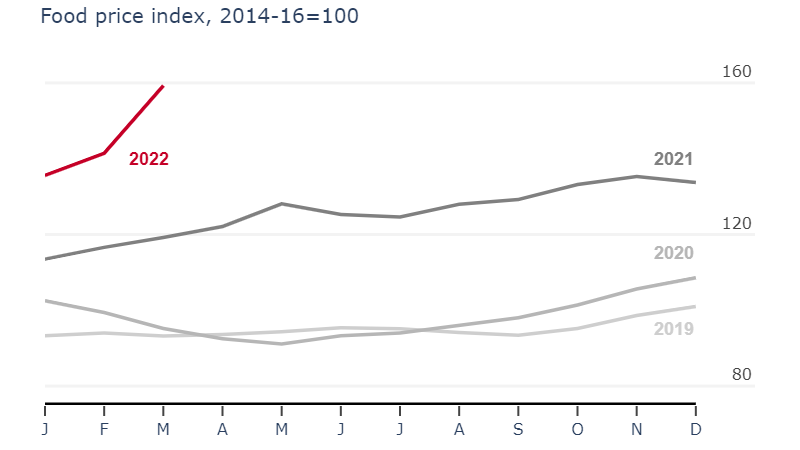

# Food Price Index Chart Replication
[The Economist Food Price Index Chart](https://www.economist.com/graphic-detail/2022/04/08/russias-invasion-of-ukraine-is-causing-record-high-food-prices?utm_medium=social-media.content.np&utm_source=twitter&utm_campaign=editorial-social&utm_content=discovery.content&%3Ffsrc%3Dscn%2F=tw%2Fdc)

I wanted to see if I could replicate this chart using [Plotly](https://plotly.com/python/)

